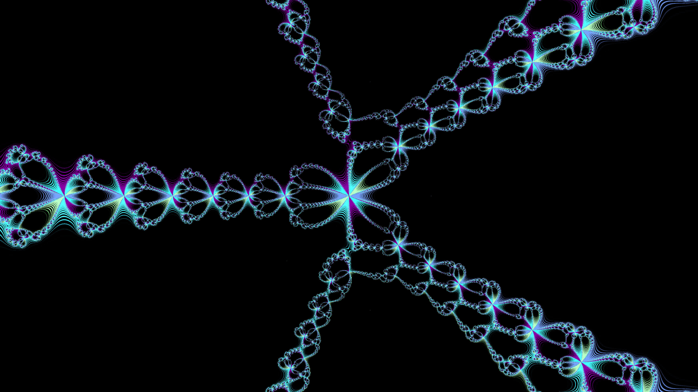

# MetodosNumericos
Repositorio con el material de trabajo del curso de Métodos Numéricos y programación de la UNISON.

Agosto-Diciembre 2023

* [Iteración de punto fijo](https://www.geogebra.org/m/amy6tw5t)

